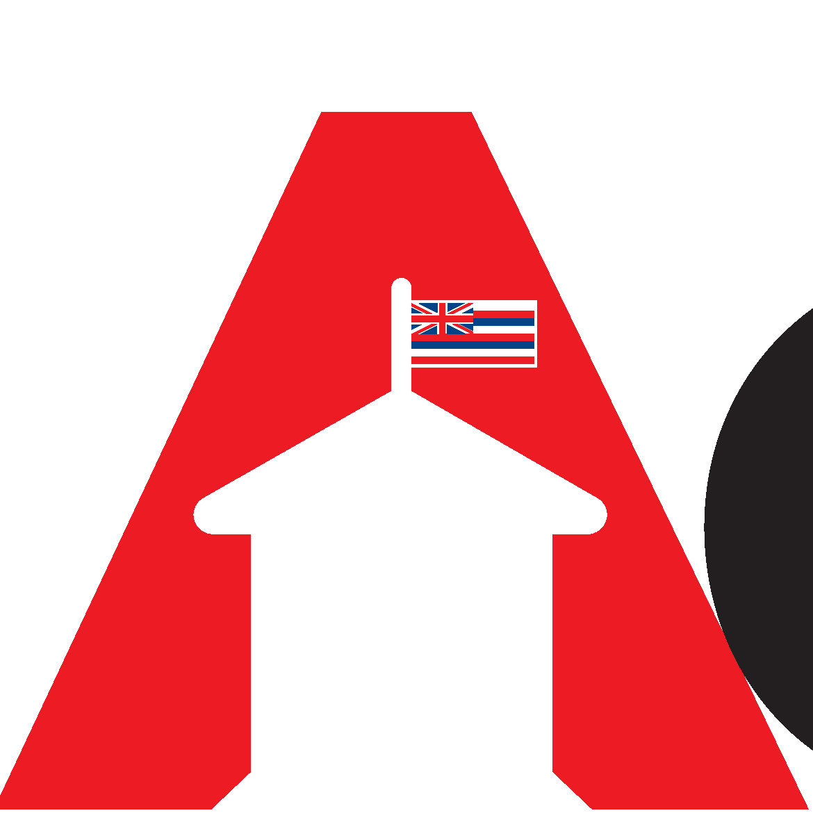

In 2019 I participated in the Hawaii Annual Code Challenge where we competed in the high school division. In this project, we leveraged Django to serve our webpage to our users.
For the Database, we selected MongoDB for the high write speeds for the data that would come into the system. I was in charge of connecting the data into the webpage so we could graph and display the data.

We then also used Python to help clean any data that we imported into the database. To do that we leveraged libraries such as pandas. With this project, we ended up getting first
place in the High School Division.

Source: <a href="https://github.com/HACC2019/shc">SHC</a>
