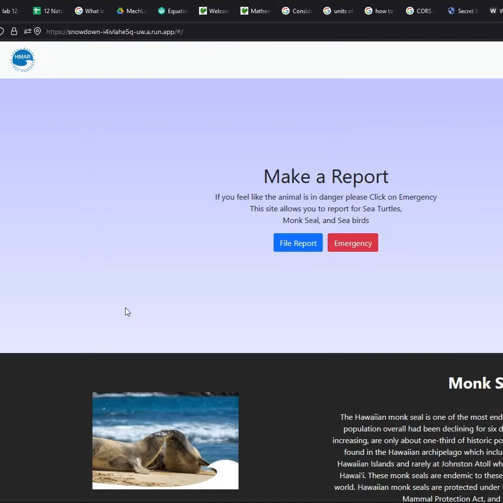

  

During the 2021 fall, Hawaii put on one of its annual code challenges. During that competition, I created my own team and I tackled one of the problems that they issued to everyone. The project I took on was to help develop a platform to help the public alert public officials of the endangered monk seals. During this project, I leveraged a mongo db database, Python, and React. To see further what this project can do go to the project site at: <a href="https://devpost.com/software/snow-down">https://devpost.com/software/snow-down</a>
